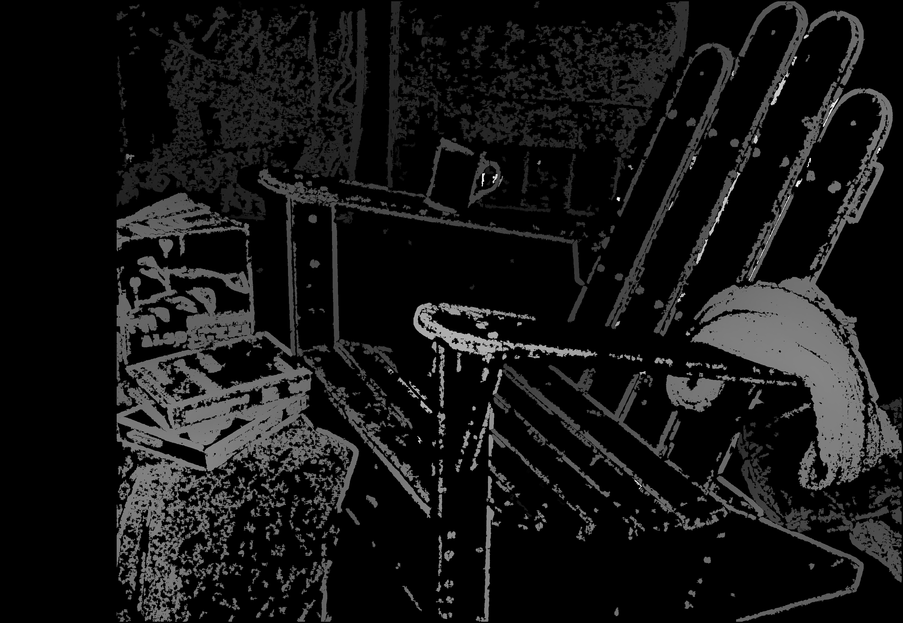
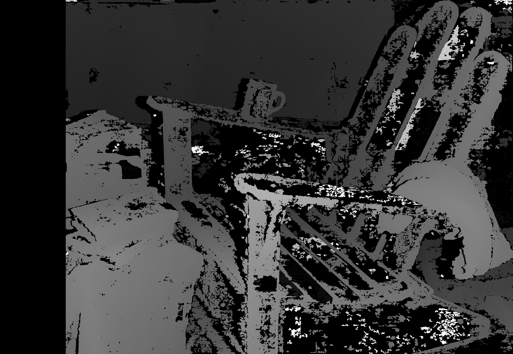
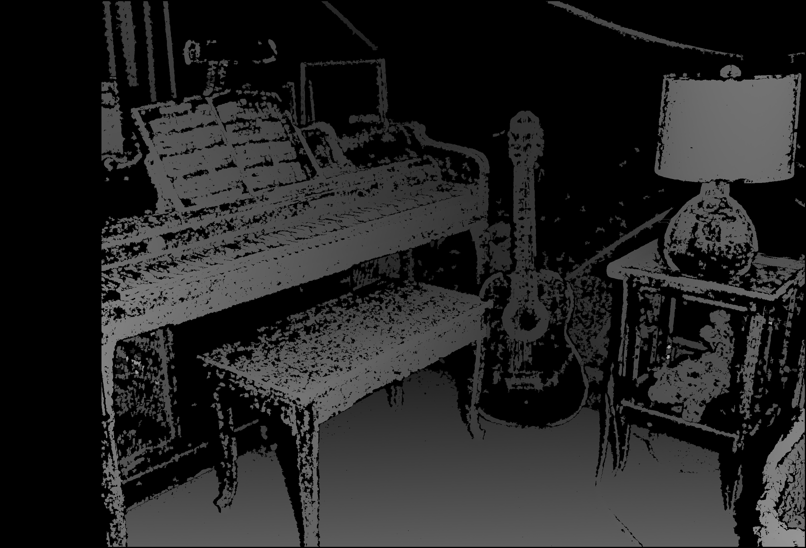
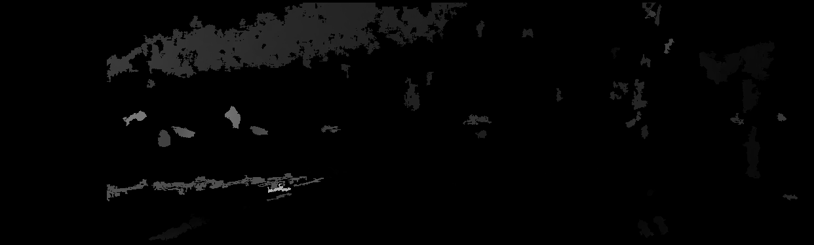
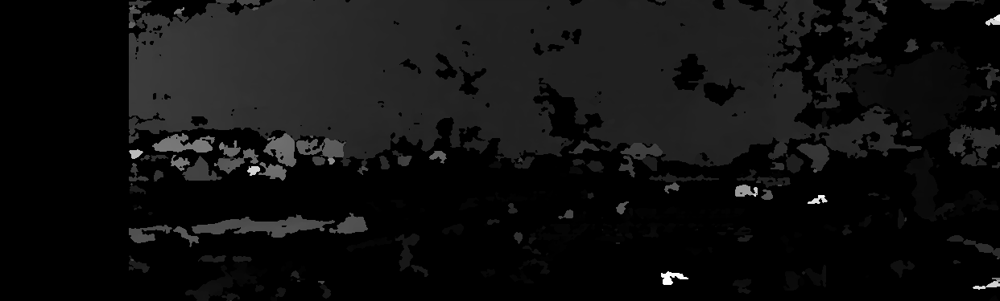
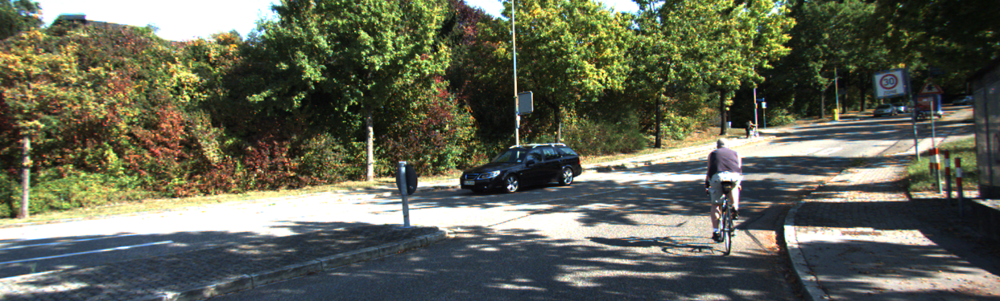
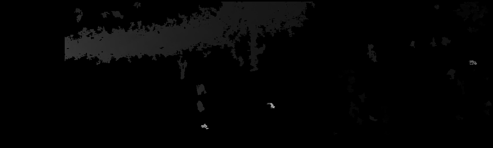
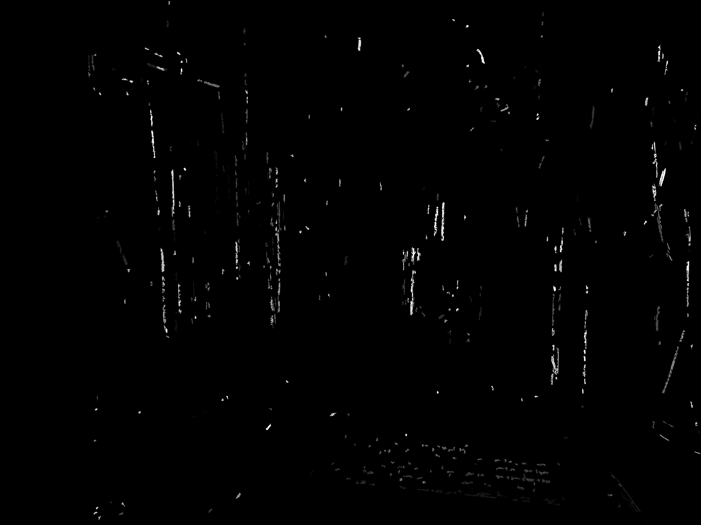
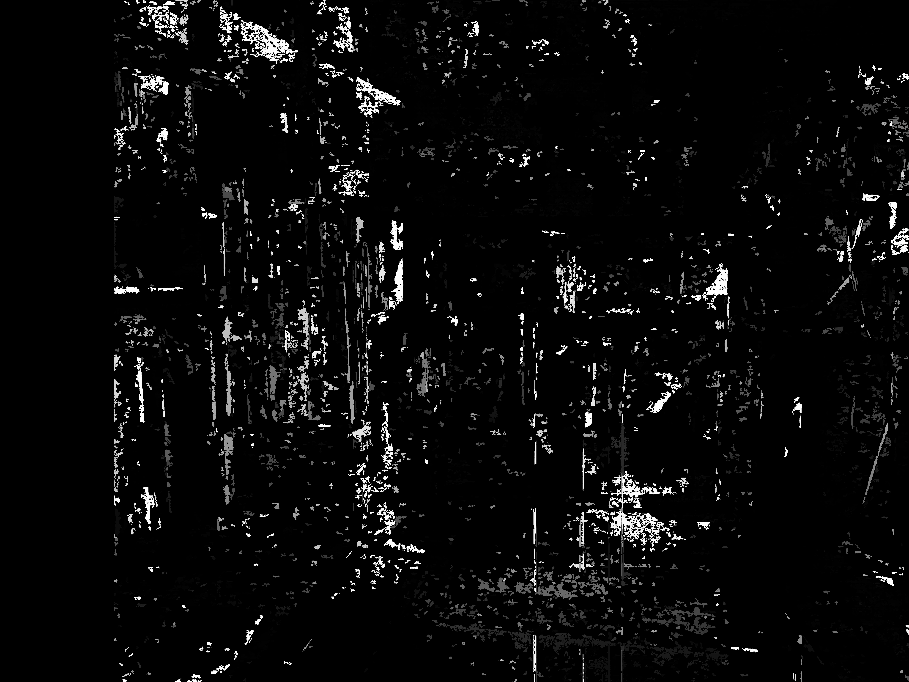

# Stereo-Matching
## `【武汉大学遥感学院】CV&PR课设 | 极线纠正+立体匹配`

[left0](./left0) [right0](./right0) **相机拍摄原始左右影像**  
[EpipolarImg](./EpipolarImg) **核线影像（MiddleBury/KITTI/自己拍摄）** 

## 极线纠正 Epipolar Rectification
[StereoMatching.cpp](./StereoMatching.cpp) **极线纠正程序**  
[out_calibration.yml](./out_calibration.yml) **相机和影像参数文件**
- 张正友法相机标定
- 影像立体纠正

## 立体匹配 Stereo Matching
[StereoRecticy.cpp](./StereoMatching.cpp) **立体匹配程序**  
- 局部匹配 BM *(block matching)*
- 半全局匹配 SGBM *(semi-global block matching)*
### 核线影像（左0）与视差图（BM/SGBM）
>MiddleBury

    
    
 
>KITTI

    
    
>自己拍摄

    
